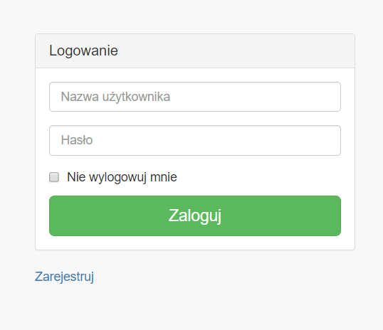
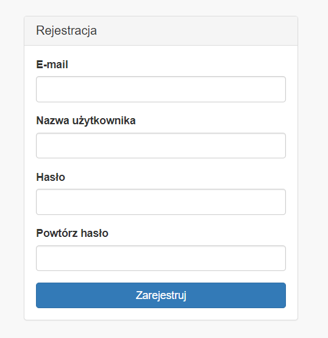
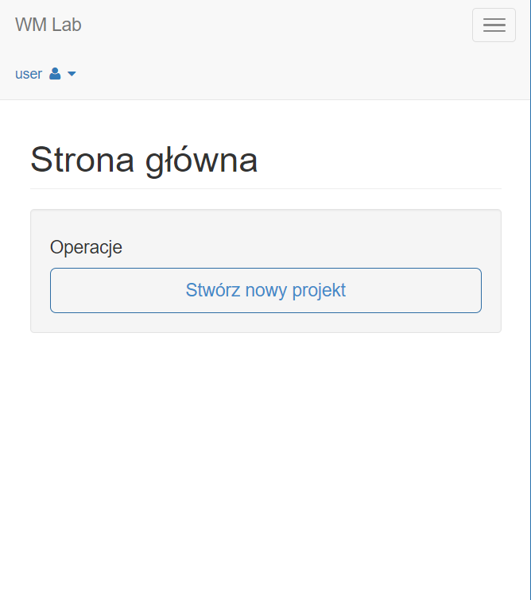
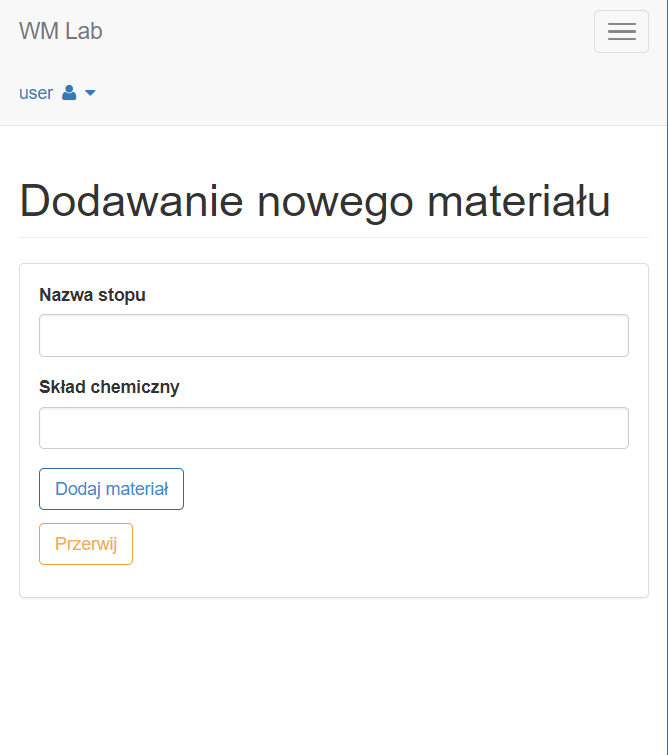
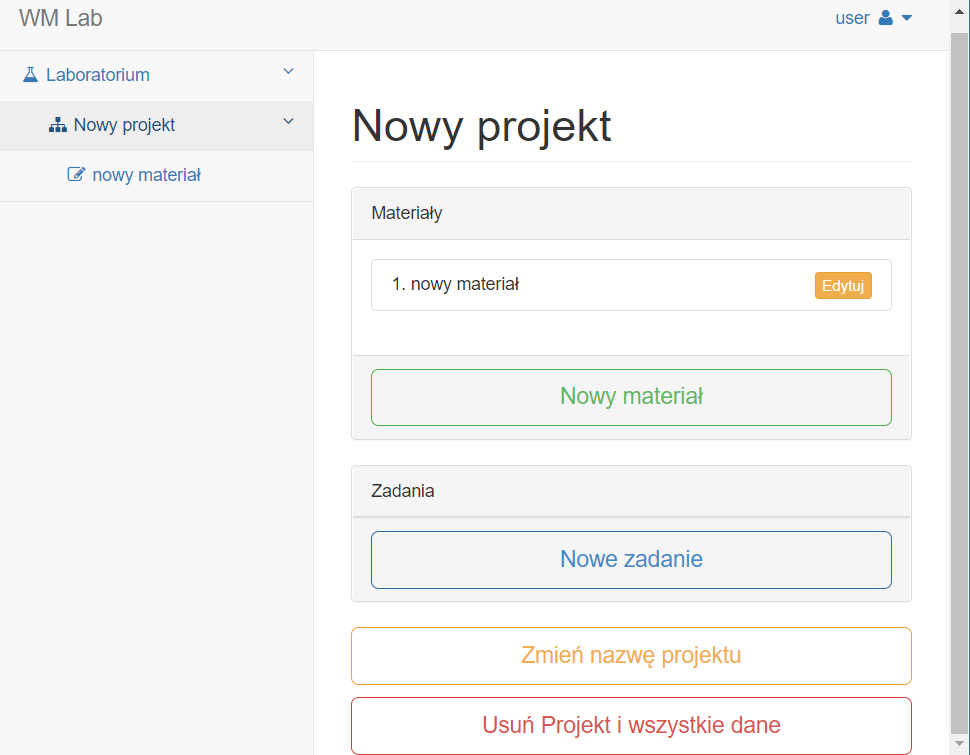
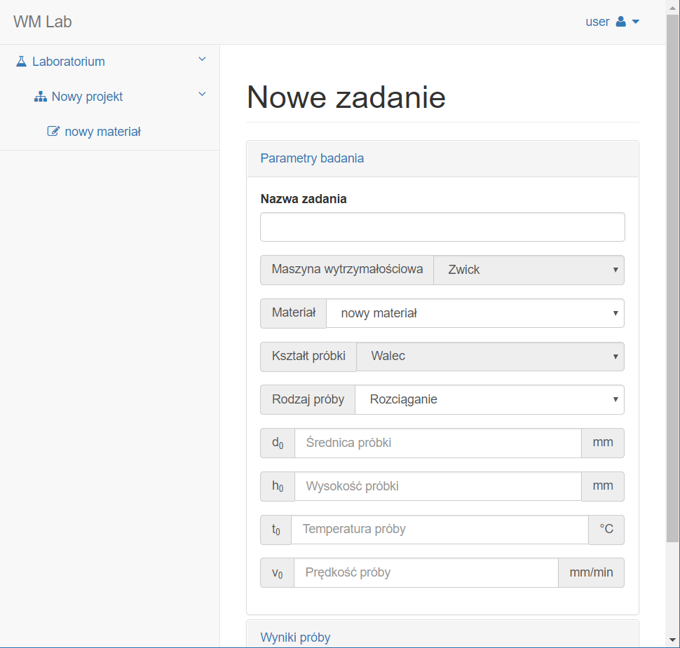
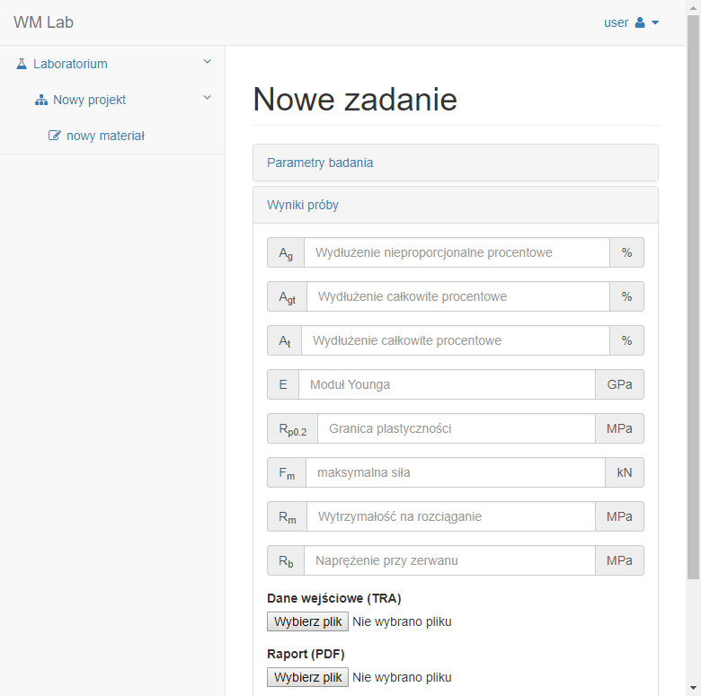
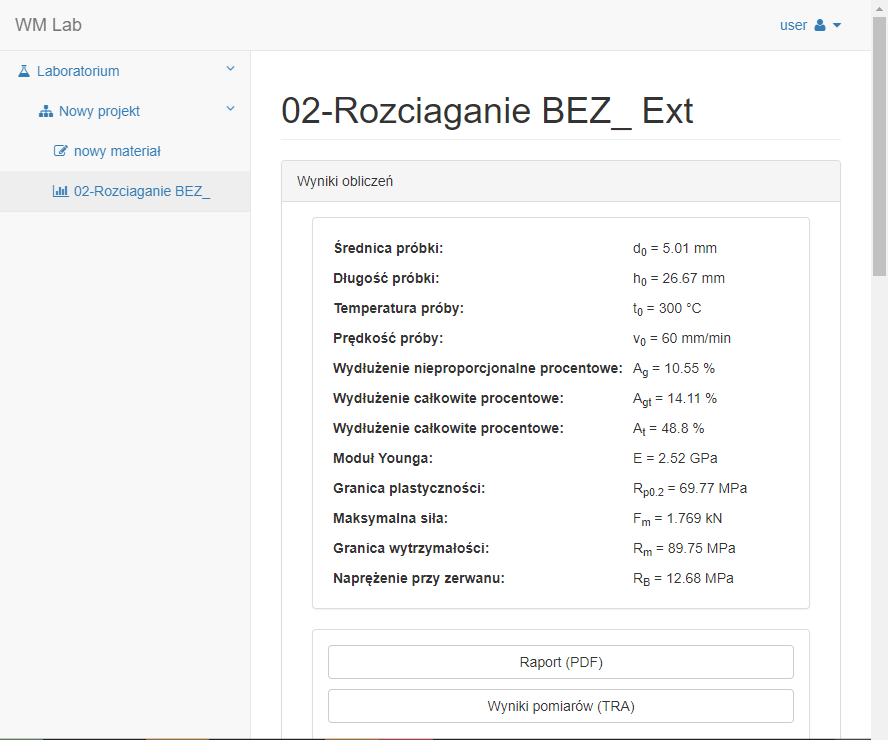
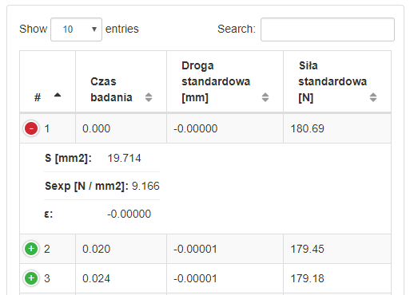
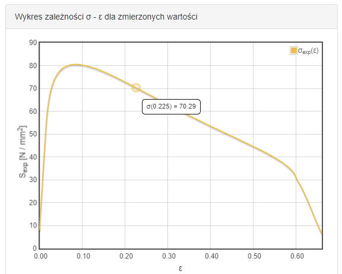

# WM Lab

This project is realization of Bachelor thesis titled: "Project and 
implementation web application to store and process results of laboratory measurements".
Application is based on measurements taken from laboratory of streanght of materials.
Initial conditions are based on output data from testing machine "Zwick Z250".  
The language of implementation is Polish.

## Getting Started

These instructions will get you a copy of the project up and running on your local 
machine for development and testing purposes. 
See deployment for notes on how to deploy the project on a live system.

### Prerequisites

```
PHP version >= 5.6.24,
Composer version >= 1.4.1,
Web server (Apache),
MySQL database server (optional)
PDO-SQLite PHP extension enabled;
```
and the usual Symfony application requirements for version 3.4:
https://symfony.com/doc/current/reference/requirements.html

### Installing

1. Get project to your machine
2. Install dependencies via Composer:
```
 $ composer create-project symfony/symfony-demo
```
3. Configure a fully-featured web server like Nginx or Apache to run the application.
https://symfony.com/doc/current/setup/web_server_configuration.html

## Deployment

Process of deploying Symfony applications is described in documentation: https://symfony.com/doc/current/deployment.html

## Screenshots

  
  
  
  
  
  
  
  
  
  

## Authors

* **Sebastian Wiewióra** - *graduate student*
